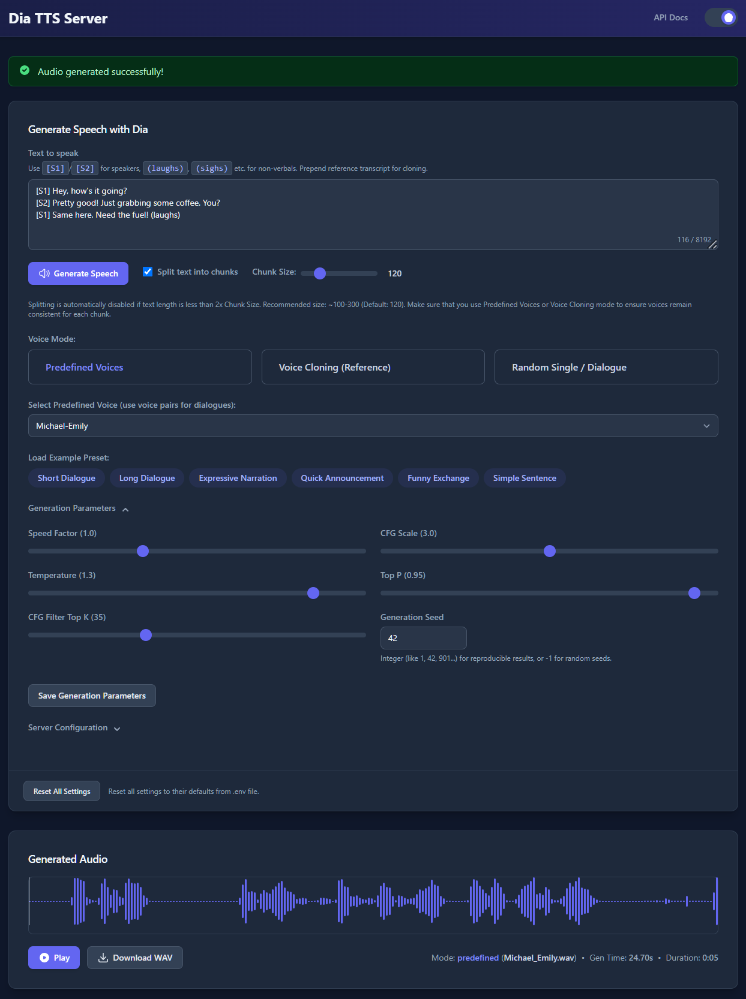
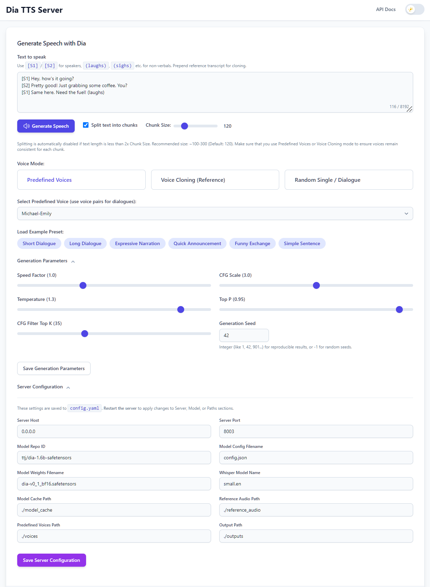

# speech-io-server: OpenAI-compatible Speech API (STT/TTS)
**On-Premise speech processing server featuring both Text-to-Speech and Speech-to-Text capabilities in a single platform.**

## Quick Start
Run the following commands to start the server:
```bash
git clone https://github.com/devnen/speech-io-server.git
cd speech-io-server
cp config.example.yaml app/config.yaml
docker compose up -d
docker compose logs -f
```

[](LICENSE)
[](https://www.python.org/downloads/)
[](https://fastapi.tiangolo.com/)
[](https://github.com/huggingface/safetensors)
[](https://www.docker.com/)
[](#)
[](https://developer.nvidia.com/cuda-zone)
[](https://platform.openai.com/docs/api-reference)

<div align="center">
  
  
</div>

---

## ✅ Features

*   **Core Speech Processing Capabilities:**
    *   **Text-to-Speech (via [Nari Labs Dia](https://github.com/nari-labs/dia)):**
        *   🗣️ Generate multi-speaker dialogue using `[S1]` / `[S2]` tags.
        *   😂 Include non-verbal sounds like `(laughs)`, `(sighs)`, `(clears throat)`.
        *   🎭 Perform voice cloning using reference audio prompts.
    *   **Speech-to-Text (via [OpenAI Whisper](https://github.com/openai/whisper)):**
        *   🎤 Transcribe speech from various audio formats.
        *   🌎 Support for multiple languages with auto-detection.
        *   ⏱️ Optional timestamp generation for word/segment alignment.
*   **Enhanced Server & API:**
    *   ⚡ Built with the high-performance **[FastAPI](https://fastapi.tiangolo.com/)** framework.
    *   🤖 **OpenAI-Compatible API Endpoints**:
        *   `/v1/audio/speech` for TTS (includes `seed`).
        *   `/v1/audio/transcriptions` for STT.
    *   ⚙️ **Custom API Endpoints**:
        *   `/tts` exposing all Dia generation parameters (includes `seed`, `split_text`, `chunk_size`, `transcript`).
        *   `/stt` exposing all Whisper transcription parameters.
    *   📄 Interactive API documentation via Swagger UI (`/docs`).
    *   🩺 Health check endpoint (`/health`).
*   **Advanced Generation Features:**
    *   📚 **Large Text Handling:** Intelligently splits long inputs into chunks based on sentences and speaker tags, generates audio for each, and concatenates the results seamlessly. Configurable via `split_text` and `chunk_size`.
    *   🎤 **Predefined Voices:** Select from 43 curated, ready-to-use synthetic voices in the `./voices` directory for consistent output without cloning setup.
    *   🎤 **Voice Cloning:** Robust pipeline with automatic audio processing and transcript handling (local `.txt` or integrated Whisper transcription). Backend handles transcript prepending.
    *   🌱 **Consistent Generation:** Use Predefined Voices or Voice Cloning modes, optionally with a fixed integer **Seed**, for consistent voice output across chunks or multiple requests.
    *   🔇 **Audio Post-Processing:** Automatic steps to trim silence, fix internal pauses, and remove long unvoiced segments/artifacts.
*   **Intuitive Web User Interface:**
    *   🖱️ Modern, easy-to-use interface inspired by **[Lex-au's Orpheus-FastAPI project](https://github.com/Lex-au/Orpheus-FastAPI)**.
    *   💡 **Presets:** Load example text and settings dynamically from `ui/presets.yaml`. Customize by editing the file.
    *   🎤 **Reference Audio Upload:** Easily upload `.wav`/`.mp3` files for voice cloning.
    *   🗣️ **Voice Mode Selection:** Choose between Predefined Voices, Voice Cloning, or Random/Dialogue modes.
    *   🎛️ **Parameter Control:** Adjust generation settings (CFG Scale, Temperature, Speed, Seed, etc.) via sliders and inputs.
    *   💾 **Configuration Management:** View and save server settings (`config.yaml`) and default generation parameters directly in the UI.
    *   💾 **Session Persistence:** Remembers your last used settings via `config.yaml`.
    *   ✂️ **Chunking Controls:** Enable/disable text splitting and adjust approximate chunk size.
    *   ⚠️ **Warning Modals:** Optional warnings for chunking voice consistency and general generation quality.
    *   🌓 **Light/Dark Mode:** Toggle between themes with preference saved locally.
    *   🔊 **Audio Player:** Integrated waveform player ([WaveSurfer.js](https://wavesurfer.xyz/)) for generated audio with download option.
    *   ⏳ **Loading Indicator:** Shows status, including chunk processing information.
    *   🎤 **Transcription Interface:** Upload audio files for transcription directly in the UI.
    *   🌎 **Language Selection:** Choose target language for transcription or use auto-detection.
*   **Flexible & Efficient Model Handling:**
    *   ☁️ Fast models downloads with [Hugging Face](https://huggingface.co/)'s hf-transfer.
    *   🔒 Supports loading secure **`.safetensors`** weights (default).
    *   💾 Supports loading original **`.pth`** weights.
    *   🚀 Defaults to **BF16 SafeTensors** for reduced memory footprint (~half size) and potentially faster inference. (Credit: [ttj/dia-1.6b-safetensors](https://huggingface.co/ttj/dia-1.6b-safetensors))
    *   🔄 Easily switch between model formats/versions via `config.yaml`.
*   **Performance & Configuration:**
*   💻 **GPU Acceleration:** Automatically uses NVIDIA CUDA if available, falls back to CPU. Optimized VRAM usage (~7GB typical for TTS, varies by Whisper model size for STT).
    *   📊 **Terminal Progress:** Displays `tqdm` progress bar when processing text chunks.
    *   ⚙️ Primary configuration via `config.yaml`
    *   📦 Uses standard Python virtual environments.
    *   **Docker Support:**
        *   🐳 Containerized deployment via [Docker](https://www.docker.com/) and Docker Compose.
        *   🔌 NVIDIA GPU acceleration with Container Toolkit integration.
        *   🧩 Multiple image variants available:
            * Default `latest` tag with CUDA development libraries for complete functionality incl. `torch.compile`
            * Lightweight `slim` tag with runtime-only dependencies for reduced image size
        *   💾 Persistent volumes for models, reference audio, predefined voices, outputs, and config.
        *   🚀 One-command setup and deployment (`docker compose up -d`).

## 🔩 System Prerequisites

*   **Operating System:** Windows 10/11 (64-bit) or Linux (Debian/Ubuntu recommended).
*   **Python:** Version 3.10 or later ([Download](https://www.python.org/downloads/)).
*   **Git:** For cloning the repository ([Download](https://git-scm.com/downloads)).
*   **Internet:** For downloading dependencies and models.
*   **(Optional but HIGHLY Recommended for Performance):**
    *   **NVIDIA GPU:** CUDA-compatible (Maxwell architecture or newer). Check [NVIDIA CUDA GPUs](https://developer.nvidia.com/cuda-gpus). Optimized VRAM usage (~7GB typical), but more helps.
    *   **NVIDIA Drivers:** Latest version for your GPU/OS ([Download](https://www.nvidia.com/Download/index.aspx)).
    *   **CUDA Toolkit:** Compatible version (e.g., 11.8, 12.1) matching the PyTorch build you install.
*   **(Linux Only):**
    *   **NVIDIA CDI:** NVIDIA Container Device Interface enabled for docker runtime

    *   `libsndfile1`: Audio library needed by `soundfile`. Install via package manager (e.g., `sudo apt install libsndfile1`).
    *   `ffmpeg`: Required by `openai-whisper`. Install via package manager (e.g., `sudo apt install ffmpeg`).

## 💻 Installation and Setup

```bash
git clone https://github.com/devnen/speech-io-server.git
cd speech-io-server
docker compose pull
```

## ⚙️ Configuration

```bash
cp config.example.yaml app/config.yaml
```

The server now primarily uses `config.yaml` for runtime configuration.

*   **`config.yaml`:** Located in the project root. This file stores all server settings, model paths, generation defaults, and UI state. It is created automatically on the first run if it doesn't exist. **This is the main file to edit for persistent configuration changes.**
*   **UI Configuration:** The "Server Configuration" and "Generation Parameters" sections in the Web UI allow direct editing and saving of values *into* `config.yaml`.

**Key Configuration Areas (in `config.yaml` or UI):**

*   `server`: `host`, `port`
*   `model`: `repo_id`, `config_filename`, `weights_filename`, `whisper_model_name`
*   `paths`: `model_cache`, `reference_audio`, `output`, `voices` (for predefined)
*   `generation_defaults`: Default values for sliders/seed in the UI (`speed_factor`, `cfg_scale`, `temperature`, `top_p`, `cfg_filter_top_k`, `seed`, `split_text`, `chunk_size`).
*   `ui_state`: Stores the last used text, voice mode, file selections, etc., for UI persistence.

⭐ **Remember:** Changes made to `server`, `model`, or `paths` sections in `config.yaml` (or via the UI) **require a server restart** to take effect. Changes to `generation_defaults` or `ui_state` are applied dynamically or on the next page load.

## ▶️ Running the Server
```bash
docker compose up -d
docker compose logs -f
```

**Note on Model Downloads:**
The first time you run the server (or after changing model settings in `config.yaml`), it will download the required Dia and Whisper model files (~3-7GB depending on selection). Monitor the terminal logs for progress. The server starts fully *after* downloads complete.

1.  **Access the UI:** The server should automatically attempt to open the Web UI in your default browser after startup. If it doesn't for any reason, manually navigate to `http://localhost:PORT` (e.g., `http://localhost:8003`).
2.  **Access API Docs:** Open `http://localhost:PORT/docs`.
3.  **Stop the server:**
    ```bash
    docker compose down
    ```


### Docker Volumes

Persistent volumes are created for:
- `./model_cache:/app/model_cache` (Models)
- `./reference_audio:/app/reference_audio` (Reference audio)
- `./outputs:/app/outputs` (Generated audio)
- `./voices:/app/voices` (Predefined voices)
- `./config.yaml:/app/config.yaml` (Primary configuration file - **Recommended** to ensure your settings persist if the container is removed and recreated).

## 💡 Usage

### Web UI (`http://localhost:PORT`)

The most intuitive way to use the server:

*   **Text Input:** Enter your script. Use `[S1]`/`[S2]` for dialogue and non-verbals like `(laughs)`. Content is saved automatically.
*   **Generate Button & Chunking:** Click "Generate Speech". Below the text box:
    *   **Split text into chunks:** Toggle checkbox (enabled by default). Enables splitting for long text (> ~2x chunk size).
    *   **Chunk Size:** Adjust the slider (visible when splitting is possible) for approximate chunk character length (default 120).
*   **Voice Mode:** Choose:
    *   `Predefined Voices`: Select a curated, ready-to-use synthetic voice from the `./voices` directory.
    *   `Voice Cloning`: Select an uploaded reference file from `./reference_audio`. Requires a corresponding `.txt` transcript (recommended) or relies on experimental Whisper fallback. Backend handles transcript automatically.
    *   `Random Single / Dialogue`: Uses `[S1]`/`[S2]` tags or generates a random voice if no tags. Use a fixed Seed for consistency.
*   **Presets:** Click buttons (loaded from `ui/presets.yaml`) to populate text and parameters. Customize by editing the YAML file.
*   **Reference Audio (Clone Mode):** Select an existing `.wav`/`.mp3` or click "Import" to upload new files to `./reference_audio`.
*   **Generation Parameters:** Adjust sliders/inputs for Speed, CFG, Temperature, Top P, Top K, and **Seed**. Settings are saved automatically. Click "Save Generation Parameters" to update the defaults in `config.yaml`. Use -1 seed for random, integer for specific results.
*   **Server Configuration:** View/edit `config.yaml` settings (requires server restart for some changes).
*   **Loading Overlay:** Appears during generation, showing chunk progress if applicable.
*   **Audio Player:** Appears on success with waveform, playback controls, download link, and generation info.
*   **Theme Toggle:** Switch between light/dark modes.

### API Endpoints (`/docs` for details)

#### Text-to-Speech Endpoints

*   **`/v1/audio/speech` (POST):** OpenAI-compatible TTS endpoint.
    *   `input`: Text.
    *   `voice`: 'S1', 'S2', 'dialogue', 'predefined_voice_filename.wav', or 'reference_filename.wav'.
    *   `response_format`: 'opus' or 'wav'.
    *   `speed`: Playback speed factor (0.5-2.0).
    *   `seed`: (Optional) Integer seed, -1 for random.
*   **`/tts` (POST):** Custom TTS endpoint with full control.
    *   `text`: Target text.
    *   `voice_mode`: 'dialogue', 'single_s1', 'single_s2', 'clone', 'predefined'.
    *   `clone_reference_filename`: Filename in `./reference_audio` (for clone) or `./voices` (for predefined).
    *   `transcript`: (Optional, Clone Mode Only) Explicit transcript text to override file/Whisper lookup.
    *   `output_format`: 'opus' or 'wav'.
    *   `max_tokens`: (Optional) Max tokens *per chunk*.
    *   `cfg_scale`, `temperature`, `top_p`, `cfg_filter_top_k`: Generation parameters.
    *   `speed_factor`: Playback speed factor (0.5-2.0).
    *   `seed`: (Optional) Integer seed, -1 for random.
    *   `split_text`: (Optional) Boolean, enable/disable chunking (default: True).
    *   `chunk_size`: (Optional) Integer, target chunk size (default: 120).

#### Speech-to-Text Endpoints

*   **`/v1/audio/transcriptions` (POST):** OpenAI-compatible transcription endpoint.
    *   `file`: Audio file (multipart/form-data).
    *   `model`: Whisper model name (e.g., 'whisper-1', maps to configured model).
    *   `language`: (Optional) ISO language code (e.g., 'en', 'fr').
    *   `prompt`: (Optional) Text to guide the transcription.
    *   `response_format`: (Optional) 'json' or 'text' (default: 'json').
    *   `temperature`: (Optional) Sampling temperature (0.0-1.0).
*   **`/stt` (POST):** Custom STT endpoint with extended control.
    *   `file`: Audio file (multipart/form-data).
    *   `model_size`: (Optional) Whisper model size ('tiny', 'base', 'small', 'medium', 'large').
    *   `language`: (Optional) ISO language code or 'auto' for detection.
    *   `prompt`: (Optional) Text to guide the transcription.
    *   `include_timestamps`: (Optional) Boolean to include word timestamps.
    *   `temperature`: (Optional) Sampling temperature (0.0-1.0).
    *   `initial_prompt`: (Optional) Text to prepend to the audio.

## 🔍 Troubleshooting

*   **CUDA Not Available / Slow:** Check NVIDIA drivers (`nvidia-smi`), ensure correct CUDA-enabled PyTorch is installed (Installation Step 4).
*   **VRAM Out of Memory (OOM):**
    *   Ensure you are using the BF16 model (`dia-v0_1_bf16.safetensors` in `config.yaml`) if VRAM is limited (~7GB needed).
    *   Close other GPU-intensive applications. VRAM optimizations and leak fixes have significantly reduced requirements.
    *   If processing very long text even with chunking, try reducing `chunk_size` (e.g., 100).
*   **CUDA Out of Memory (OOM) During Startup:** This can happen due to temporary overhead. The server loads weights to CPU first to mitigate this. If it persists, check VRAM usage (`nvidia-smi`), ensure BF16 model is used, or try setting `PYTORCH_CUDA_ALLOC_CONF=expandable_segments:True` environment variable before starting.
*   **Import Errors (`dac`, `tqdm`, `yaml`, `whisper`, `parselmouth`):** Activate venv, run `pip install -r requirements.txt`. Ensure `descript-audio-codec` installed correctly.
*   **`libsndfile` / `ffmpeg` Error (Linux):** Run `sudo apt install libsndfile1 ffmpeg`.
*   **Model Download Fails (Dia or Whisper):** Check internet, `config.yaml` settings (`model.repo_id`, `model.weights_filename`, `model.whisper_model_name`), Hugging Face status, cache path permissions (`paths.model_cache`).
*   **Voice Cloning Fails / Poor Quality:**
    *   **Ensure accurate `.txt` transcript exists** alongside the reference audio in `./reference_audio`. Format: `[S1] text...` or `[S1] text... [S2] text...`. This is the most reliable method.
    *   Whisper fallback is experimental and may be inaccurate.
    *   Use clean, clear reference audio (5-20s).
    *   Check server logs for specific errors during `_prepare_cloning_inputs`.
*   **Permission Errors (Saving Files/Config):** Check write permissions for `paths.output`, `paths.reference_audio`, `paths.voices`, `paths.model_cache` (for Whisper transcript saves), and `config.yaml`.
*   **UI Issues / Settings Not Saving:** Clear browser cache/local storage. Check developer console (F12) for JS errors. Ensure `config.yaml` is writable by the server process.
*   **Inconsistent Voice with Chunking:** Use "Predefined Voices" or "Voice Cloning" mode. If using "Random/Dialogue" mode with splitting, use a fixed integer `seed` (not -1) for consistency across chunks. The UI provides a warning otherwise.
*   **Port Conflict (`Address already in use` / `Errno 98`):** Another process is using the port (default 8003). Stop the other process or change the `server.port` in `config.yaml` (requires restart).
    *   **Explanation:** This usually happens if a previous server instance didn't shut down cleanly or another application is bound to the same port.
    *   **Linux:** Find/kill process: `sudo lsof -i:PORT | grep LISTEN | awk '{print $2}' | xargs kill -9` (Replace PORT, e.g., 8003).
    *   **Windows:** Find/kill process: `for /f "tokens=5" %i in ('netstat -ano ^| findstr :PORT') do taskkill /F /PID %i` (Replace PORT, e.g., 8003). Use with caution.
*   **Generation Cancel Button:** This is a "UI Cancel" - it stops the *frontend* from waiting but doesn't instantly halt ongoing backend model inference. Clicking Generate again cancels the previous UI wait.

### Selecting GPUs on Multi-GPU Systems

Set the `CUDA_VISIBLE_DEVICES` environment variable **before** running `python server.py` to specify which GPU(s) PyTorch should see. The server uses the first visible one (`cuda:0`).

*   **Example (Use only physical GPU 1):**
    *   Linux/macOS: `CUDA_VISIBLE_DEVICES="1" python server.py`
    *   Windows CMD: `set CUDA_VISIBLE_DEVICES=1 && python server.py`
    *   Windows PowerShell: `$env:CUDA_VISIBLE_DEVICES="1"; python server.py`

*   **Example (Use physical GPUs 6 and 7 - server uses GPU 6):**
    *   Linux/macOS: `CUDA_VISIBLE_DEVICES="6,7" python server.py`
    *   Windows CMD: `set CUDA_VISIBLE_DEVICES=6,7 && python server.py`
    *   Windows PowerShell: `$env:CUDA_VISIBLE_DEVICES="6,7"; python server.py`

**Note:** `CUDA_VISIBLE_DEVICES` selects GPUs; it does **not** fix OOM errors if the chosen GPU lacks sufficient memory.

## 🤝 Contributing

Contributions are welcome! Please feel free to open an issue to report bugs or suggest features, or submit a Pull Request for improvements.

## 📜 License

This project is licensed under the **MIT License**.

You can find it here: [https://opensource.org/licenses/MIT](https://opensource.org/licenses/MIT)

## 🙏 Acknowledgements

*   **Core Model:** This project heavily relies on the excellent **[Dia TTS model](https://github.com/nari-labs/dia)** developed by **[Nari Labs](https://github.com/nari-labs)**. Their work in creating and open-sourcing the model is greatly appreciated.
*   **UI Inspiration:** Special thanks to **[Lex-au](https://github.com/Lex-au)** whose **[Orpheus-FastAPI](https://github.com/Lex-au/Orpheus-FastAPI)** project served as inspiration for the web interface design of this project.
*   **SafeTensors Conversion:** Thank you to user **[ttj on Hugging Face](https://huggingface.co/ttj)** for providing the converted **[SafeTensors weights](https://huggingface.co/ttj/dia-1.6b-safetensors)** used as the default in this server.
*   **Containerization Technologies:** [Docker](https://www.docker.com/) and [NVIDIA Container Toolkit](https://github.com/NVIDIA/nvidia-docker) for enabling consistent deployment environments.
*   **Core Libraries:**
    *   [FastAPI](https://fastapi.tiangolo.com/)
    *   [Uvicorn](https://www.uvicorn.org/)
    *   [PyTorch](https://pytorch.org/)
    *   [Hugging Face Hub](https://huggingface.co/docs/huggingface_hub/index) & [SafeTensors](https://github.com/huggingface/safetensors)
    *   [Descript Audio Codec (DAC)](https://github.com/descriptinc/descript-audio-codec)
    *   [SoundFile](https://python-soundfile.readthedocs.io/) & [libsndfile](http://www.mega-nerd.com/libsndfile/)
    *   [Jinja2](https://jinja.palletsprojects.com/)
    *   [WaveSurfer.js](https://wavesurfer.xyz/)
    *   [Tailwind CSS](https://tailwindcss.com/) (via CDN)

---

## How to Use Speech-to-Text

The Speech-to-Text functionality is available through both the API and the Web UI:

### STT via API

1. **OpenAI-Compatible Endpoint (`/v1/audio/transcriptions`):**
   ```bash
   curl -X POST http://localhost:8003/v1/audio/transcriptions \
     -H "Content-Type: multipart/form-data" \
     -F file=@/path/to/audio.mp3 \
     -F model=whisper-1 \
     -F language=en
   ```

2. **Custom Endpoint (`/stt`):**
   ```bash
   curl -X POST http://localhost:8003/stt \
     -H "Content-Type: multipart/form-data" \
     -F file=@/path/to/audio.mp3 \
     -F model_size=small \
     -F language=auto \
     -F include_timestamps=true
   ```

### STT via Web UI

1. Navigate to the Transcription tab in the Web UI
2. Upload your audio file using the file selector or drag-and-drop
3. Select model size and language (optional)
4. Click "Transcribe"
5. View the results and download as needed

### STT Configuration

Configure STT behavior in `config.yaml`:
```yaml
model:
  whisper_model_name: "small"  # Options: tiny, base, small, medium, large

stt_defaults:
  language: "auto"
  include_timestamps: false
  temperature: 0.0
```

## Todos:
- Dockerfile optimisation
  - Bump CUDA versions
  - Use runtime instead of devel build
  - add multi-stage build
- Model compile optimization
- k8s deployment, hpa, helm chart
- auto config at startup
- Add Web UI for STT functionality
- Batch processing for STT
- Streaming API for real-time STT
- Support for additional STT models
